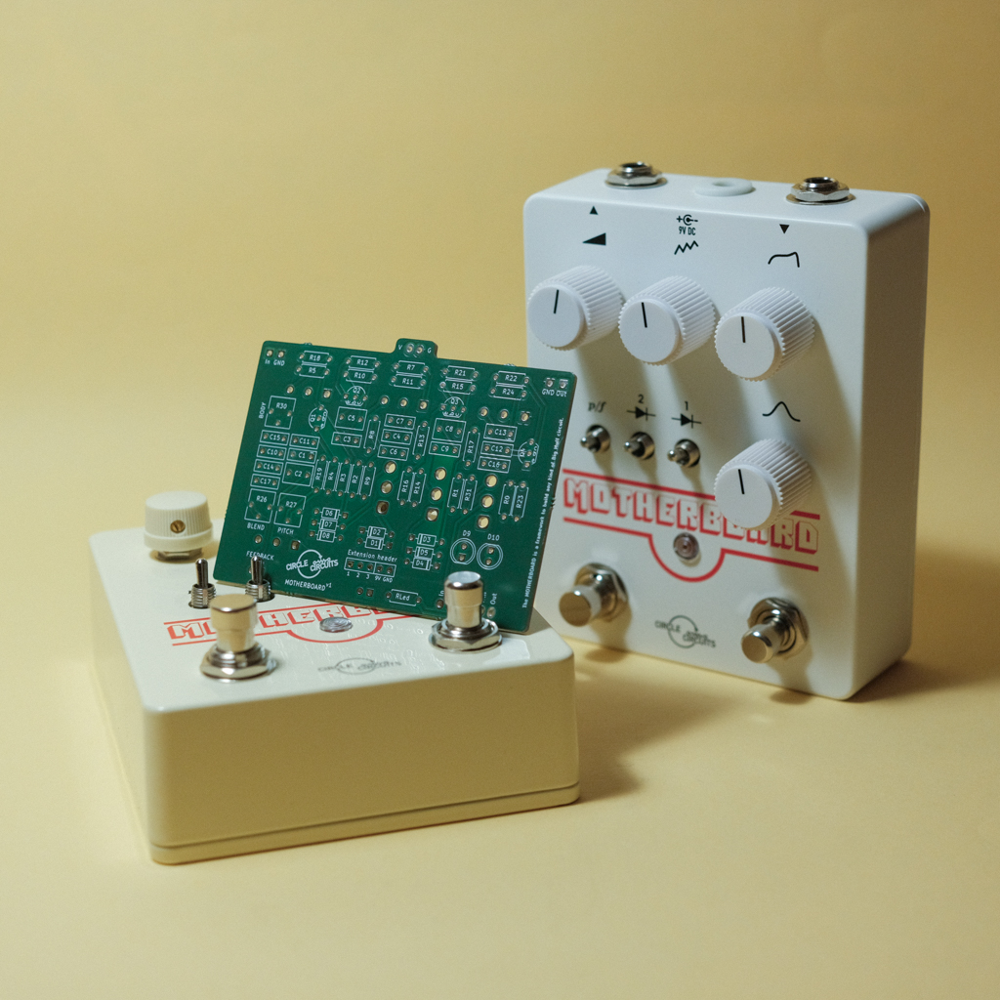

The Motherboard
==================

The Motherboard is an open-sourced PCB (Printed Circuit Board) based on the famous Big Muff circuit and designed as an experimentation platform rather than a 1:1 clone.

This repository provides everything you need to build the pedal pictured below: schematic, gerber files, bill of materials, drill guide and UV printing template.

## Who is this for ?

If you've already built a guitar pedal, you know how to solder parts and wire a 3PDT footswitch and jacks, then you should be fine !

If you're a pro, feel free to skip the docs and go straight to the [source files](/sources/).

## Docs
Start here to build your own Motherboard.
1. [About the circuit](/docs/1_About_the_circuit.md)
2. [The PCB](/docs/2_Get_the_pcb.md)
3. [Bill of material](/docs/3_Get_the_parts.md)
4. [Drill guide](/docs/4_Drill_the_enclosure.md)
5. [Assembly](/docs/5_Assembly.md)
