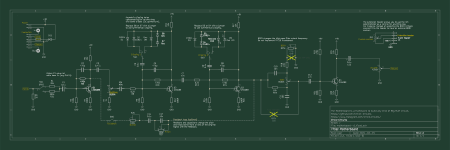

About the circuit
==========================

## Schematic

Let's have a look at the schematic. Click on the image below to download it or prefer the [black and white version](/sources/motherboard-v1-bw.pdf) for printing.

<small>(Right click on the image + save link as)</small>

## Topology

This is indeed a Big Muff circuit, with a few additions.

The Big Muff dates back to the 70s and has since be derived into many variations by many different brands under many different names. 

While there are a lot of components involved, it is fairly straightforward to understand. Have a look at [Electrosmash](https://www.electrosmash.com/big-muff-pi-analysis)'s article if you want to know more.

## Mods

This particular circuit exposes some of the most popular modifications and allows us to appreciate the range of sonic possibilities of various Big Muffs at once.

### Input gain selection

1 toggle switch to set the input gain of the pedal. A lower input gain is handy if your signal is already distorted before the input.

### Clipping diodes selection

2 toggle switches to select the diodes of the first and second clipping stages.

### Feedback loop

A feedback loop triggered by a switch (can be a footswitch).

### Tone control

An additional `BODY` control that enables more or less mids to come out of the tone stack (see [AMZ Tone Control](https://www.muzique.com/lab/tone3.htm)).

### Extension header

An extension bay with space for an additional potentiometer, to extend the circuit and add your own custom control.

### Fuzz War tone stack

The Fuzz War is also derived from a Big Muff (at least the latest version of it) but the tone stack is quite specific. 

On the schematic you will see 2 crossed-out capacitors: `C15` and `C16`. These parts should be ignored when building a regular Big Muff. However, if you would like to replicate a Fuzz War, you will need to solder those and ignore the `BODY` trimpot.

Note that you might need to adjust all the parts values. You will need to do you're own research for that. :)

---
<small>Read next: [/docs/2_Get_the_pcb.md](/docs/2_Get_the_pcb.md)</small>