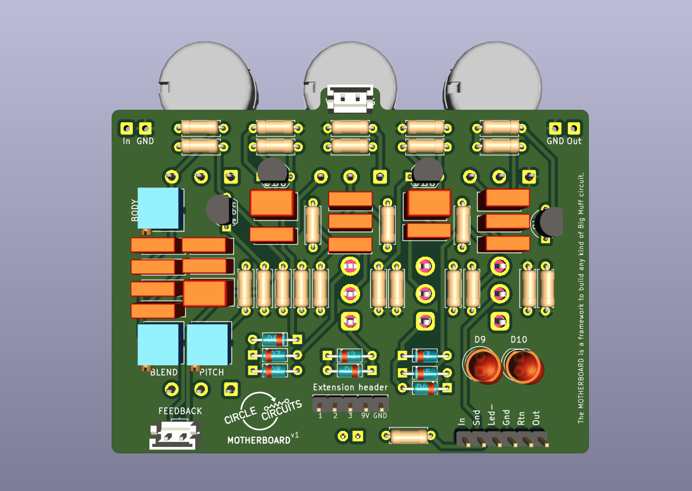
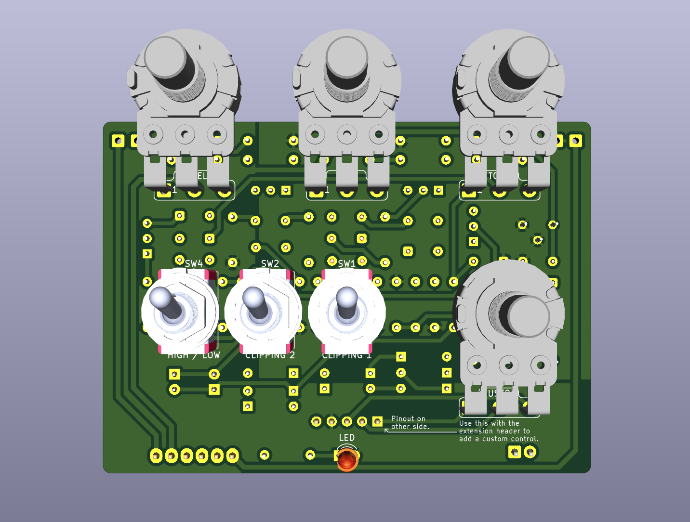

The PCB
==================

## Manufacturing

[Geber files](https://github.com/Circle-Circuits/motherboard/raw/main/sources/gerbers_motherboard_v1.zip) contain all the necessary information to manufacture a circuit board.
Most Manufacturer should be able to use these files.

I've been using Aisler, in Germany. You can order straight from Aisler using this link: https://aisler.net/p/YQFEDFUC

Note that price and minimum order quantity may vary a lot dependending on manufacturers.

If you would like to use a different manufacturer, [download the files here](https://github.com/Circle-Circuits/motherboard/raw/main/sources/gerbers_motherboard_v1.zip) and send them to your manufacturer of choice.

## Notes on the PCB

You may have noticed the PCB has 4 potentiometers.

The top 3 are the classic Big Muff controls. 

The 4th potentiometer, marked as `CUSTOM` on the PCB, is optional and is wired to the `extension header`. Its pins are marked `1`, `2` and `3` on the header.

You can use this potentiometer to add an external control to any part of the circuit, replacing the part with wires to the header.

### Here are some ideas:
#### A. External BODY control

This is the mod I chose for my original Motherboard pedal, as pictured on the front page.

To do this, do not solder the `BODY` trimpot and wire it to the `extension header` instead. This will expose the `BODY` control as an external potentiometer. 

Because 2 pins for the trimpot are wired to ground, you actually only need one wire to do this mod. 

The left-most pin of the `BODY` trimpot is wired to pin `1` of the `extension header`. Then pin `2` and `3` of the `extension header` are wired to the `GND` pin.

You can now use the `CUSTOM` potentiometer instead of the `BODY` trimpot. 

A B25k potentiometer works best for this. 

#### B. Feedback loop pitch control

Instead of soldering the `PITCH` trimpot, wire it to the extension header 1-2-3 pins to be able to control the pitch of the feedback from the `CUSTOM` potentiometer.

Note: the trimpots left-most pin is always pin `1`.

#### C. Variable input gain control

Instead of soldering `R31`, solder jumper wires to the `extension header` to use the 4th potentiometer as variable resistor, controling how much signal hits the first clipping stage.

Maybe try a B250k or B500k for this.  

#### D. Clipping diodes blend control 

*Note: I haven't tested this mod !*

In place of one of the clipping toggle switch, use the potentiometer to send a variable share of the signal to each diodes selection to get a blend of both textures.

## Renders

Here's what the PCB looks like with all parts populated. 

---
<small>Read next: [/docs/3_Get_the_parts.md](/docs/3_Get_the_parts.md)</small>