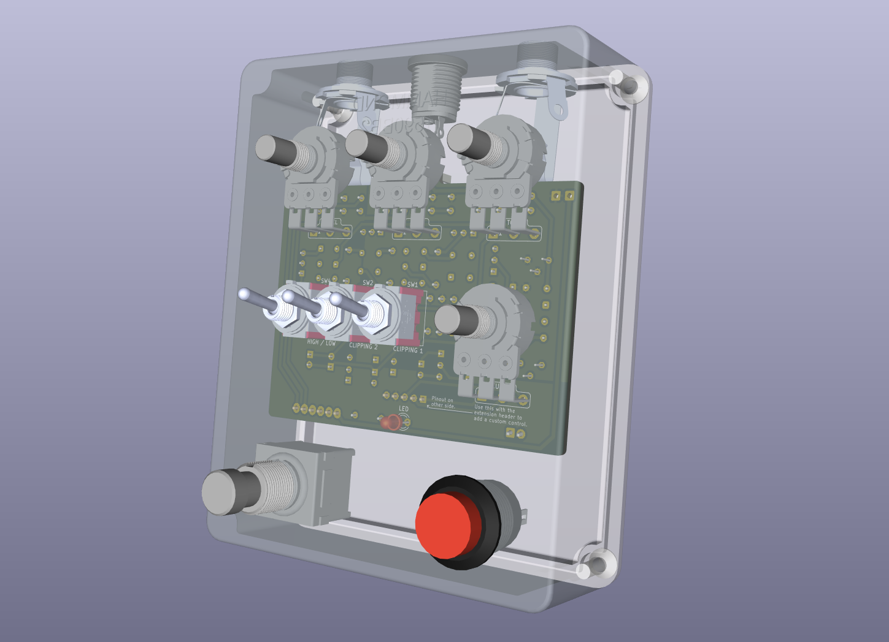

Assembly
==========================

## Checklist

It's time to make sure you have everything you need.

### Parts
- the PCB
- the BOM
- the enclosure
- some wires

### Tools
- soldering iron
- solder
- wire stripper
- wire cutter

## Workflow

IMPORTANT: solder the toggle switches before the potentiometers. Solder the potentiomers while everything is mounted in the enclosure.

Don't forget to cut the little stud of the potentiometers.

Try out the circuit before solder the LED ?

### Very important !

Solder the toggle switches (without any washer or bolt) before the potentiometers !

### Recommendations

I recommend soldering components by order of height, starting witht the lower components.

In practice, this means soldering components in this order:
1. resistors and diodes
2. capacitors (except electrolytics), trimpots and sockets
3. transistors
4. electrolytic capacitors (if any)

Avoid heating any component for more than 3 sec, especially transistors and diodes. If you're worried about overheating a part, you can attach a crocodile clip to it, hence deviating some of the heat to the clip instead of the component.

Hardware can take up more heat (especially jacks)
When working on a heat sensitive part (i.e. transistors and diodes), do not  use sockets or attach a crocodile clip to it to deviate the heat
Diodes are fragile ! Hold the base of the lead with pliers before bending

